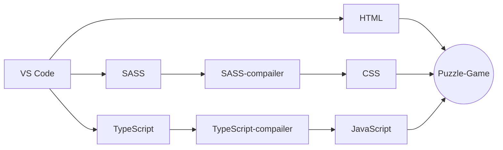

#puzzle-game

simple puzzle game built with **HTML Drag and Drop API**.
built with pure HTML, CSS(SASS), JavaScript(TypeScript). No library used.

##flow Chart

> **Note:** doesn't work on any touch devices as of now
