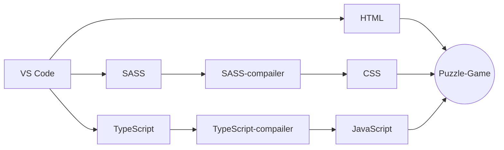

###puzzle-game

simple puzzle game built with **HTML Drag and Drop API**.
built with pure HTML, CSS(SASS), JavaScript(TypeScript). No library used.

##flow Chart


```flow
st=>start: Login
op=>operation: Login operation
cond=>condition: Successful Yes or No?
e=>end: To admin

st->op->cond
cond(yes)->e
cond(no)->op
```

> **Note:** doesn't work on any touch devices as of now
